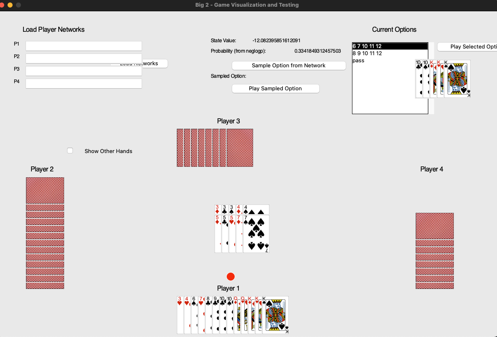

# Big 2 Self-Play Reinforcement Learning AI



- This repo is based on https://github.com/henrycharlesworth/big2_PPOalgorithm
- Scoring rules is set according to https://big2.lihkg.com/ (see the following).
- Game rules changed to Hong Kong style:
  - Don't allow JQKA2, QKA23, KA234
  - Allow A2345 and 23456
  - Don't allow playing Four-of-a-kind without a single card.
  - Allow playing King Kong (i.e. Four-of-a-kind + One card)
  - Don't allow playing two pairs.
- Pytorch implementation
- Implemented the following RL algorithms with additional ways to handle dynamic action space (to be documented...):
  - Neural Replicator Dynamics
  - PPO

# Play against the AI with the pre-trained model (Only tested on Mac)
```
conda env create -f environment.yml 
conda activate big2torch
python generateGUI_torch.py
```

# Game Scoring Rules

## When the game ends, score based on remaining cards in hand.

## Basic Scoring:

- Less than 8 cards, 1 point per card;

- ≥8 cards is "double penalty" (remaining cards x 2);

- ≥10 cards is "triple penalty" (remaining cards x 3);

- 13 cards is "quadruple penalty" (remaining cards x 4).

**P.S.** For the first player to play a card, ≥7 cards is "double wonderful".

## Final Score:

- A's score = (B's card points - A's card points) + (C's card points - A's card points) + (D's card points - A's card points)

- B's score = (A's card points - B's card points) + (C's card points - B's card points) + (D's card points - B's card points)

- C's score = (A's card points - C's card points) + (B's card points - C's card points) + (D's card points - C's card points)

- D's score = (A's card points - D's card points) + (B's card points - D's card points) + (C's card points - D's card points)

**P.S.** The first place gets an additional +10 points bonus


# TODO
- Code refactoring and improve the game simulation efficiency.
- Implement a web UI.
- Implement the DeepNash model: https://arxiv.org/abs/2206.15378
- Document this new idea of handling dynamic action space.
- Containerized the application.


# Acknowledgement
- Charlesworth, H. (2018). Application of self-play reinforcement learning to a four-player game of imperfect information. arXiv preprint arXiv:1808.10442.
